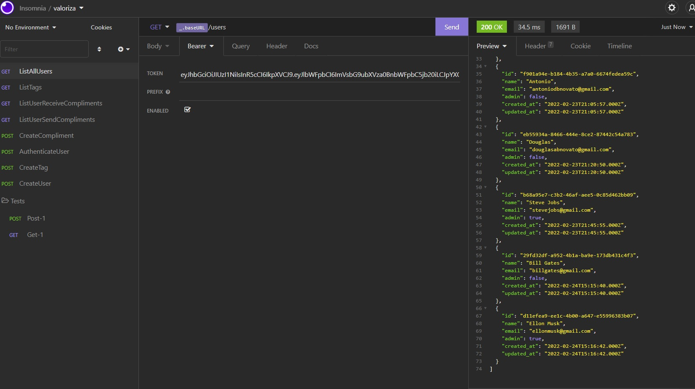
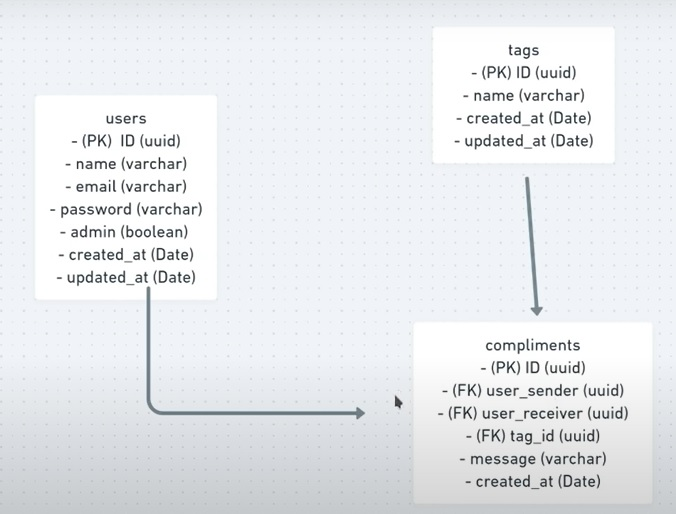
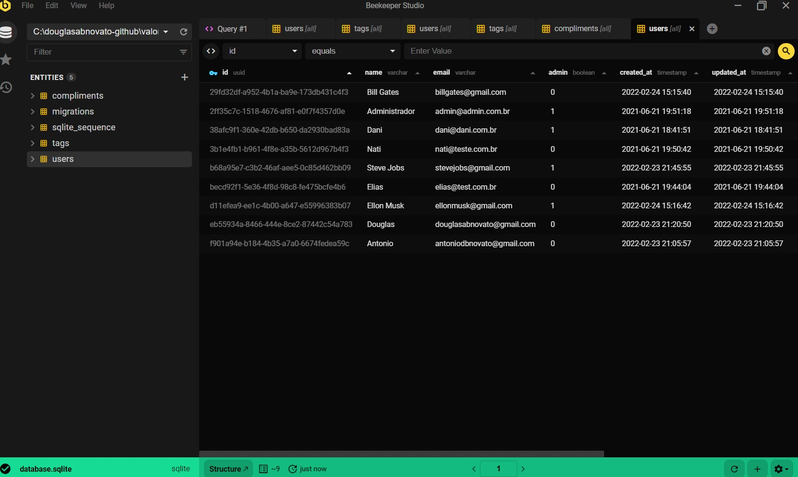

<h1 align="center">Valoriza</h1>
<p align="center">
  

  
</p>
<p align="center">
  
</p>

## 💻 Projeto

Valoriza é uma plataforma para promover o reconhecimento entre companheiros de equipe.


<p align="center">
   
   
   
</p>

## ✨ Tecnologias

Esse projeto foi desenvolvido com as seguintes tecnologias:

- VSCode: editor de código
- [Node.js](https://nodejs.org/en/): 
- Npm, Yarn: Gerenciador de pacotes
- Insomnia: testar as requisições
- Beekeeper: Gerenciador de bd
- [Typescript](https://www.typescriptlang.org/)
- [Express](https://expressjs.com/pt-br/)
- [JSONWebToken](https://github.com/auth0/node-jsonwebtoken#readme)
- Extensão: jetbrains mono
- Postgree: banco de dados
- Linguagem SQL
- TypeORM

## 💻 Detalhes do Projeto

### Liftoff
Instalar, Configurar e Testar o typescript no projeto
- [x] criar o projeto: `yarn init -y`: para criar o package.json
- [x] adicionar o typescript: `yarn add typescript -D`
- [x] executar no node: `node testtypescript.ts`
- [x] inicializar o typescript: `yarn tsc --init` 
- [x] converter o typescript: `yarn tsc` então cria o `testtypescript.js` 
- [x] executar no node: `node testtypescript.js`

Instalar, Configurar e Testar o express no projeto
- [x] adicionar o express: `yarn add express`
- [x] adicionar o biblioteca de tipagem: `yarn add @types/express -D`
- [x] converter o typescript: `yarn tsc` então cria o `server.js` 
- [x] executar no node: `node src/server.js`
- [x] `yarn add ts-node-dev -D`: para não ficar executando tsc todo vez.
- [x] src/server.ts
````typescript
import express from "express";
const app = express();//@types/express
app.listen(3000, () => console.log("Server is running"));//http://localhost:3000
````

Instalar, Configurar e Testar as routes no projeto
- [x] métodos disponíveis no protocolo http: get(buscar), post(inserir), put(editar), delete(remover), patch(alterar uma informação específica)
- [x] request(entrando), response(saíndo)
- [x] duas rotas testes em src/server.ts
````typescript 
app.get("/test", (req, res) => {
  return res.send("Olá NLW, método GET.")
})
app.post("/test-post", (req, res) => {
  return res.send("Olá NLW, método POST")
}) 
````
- [x] o método post não funciona diretamente pelo navegador, somente o get. Por isso, vamos ao insomnia para testar nossos métodos de requisição.

Construir e testar as requisições as rotas no insomnia
- [x] rota test com método GET
- [x] rota test-post com método POST

### Maximum Speed

- [x] Cadastro de usuários

Modelar, Criar e entender o banco de dados
- [x] O modelo de informações
- [x] Tipos de Parâmetros de requisições:
- Routes params: http://localhost:3000/produtos/78347583458345
- Query params: http://localhost:3000/produtos?name=teclado&descreption=tecladobom
- Body params: {"name": "teclado", "description":"tecladobom"}
- [x] Escolha do banco de dados para nossa necessidade de armazenamento de informações: 
- Opções de banco de dados: Postgree 
- Três formas de usar o banco de dados na aplicação: driver nativo do bd(Postgree), query builders(Knexjs), ORM(Sequelize, TypeORM, Prisma)
- Escolha para nossa aplicação é o TypeORM

Criar, configurar o banco de dados em ormconfig.json
- [x] TypeORM
- Instalação: `yarn add typeorm reflect-metadata sqlite3`
- Configuração através do arquivo json: `ormconfig.json`
- Inicialização do bd: `src/database/index.ts`
- Importação do bd no server: `import "./database";`
- [x] Migrations: controle de versionamento de tabelas
- configuração no ormconfig.json - cli: migrationsDir, entitiesDir
- `yarn typeorm -help`
- [x] Criar entidades Migrations (Usuário)
- `yarn typeorm migration:create -n CreateUsersTest`
- métodos up e down 
- configurando em createTable na CreateUsers conforme o modelo de negócios apresentado anteriormente.
- configurando em dropTable na CreateUsers
- rodar a migrations para inserir no banco de dados:`yarn typeorm migration:run`
- rodar a migrations para reverter no banco de dados:`yarn typeorm migration:revert`
- criar entidades no banco de dados: `yarn typeorm entity:create -n User`
- em tsconfig.json, configurar "experimentalDecorators": true, "emitDecoratorMetadata": true e "strictPropertyInitialization": false
- instalar biblioteca: `yarn add uuid` e suas tipagens: `yarn add @types/uuid -D`

Criar a camada Repositório que comunica nossa entidade com o BD
- Configurar os métodos CRUD para interagir com o bd: `Repositories/UsersRepositories.ts`
- Configurar os services - as regras de negócio

As regras de Negócio
Cadastro de Usuário
- [x] Não é permitido cadastrar mais de um usuário com o mesmo e-mail
- [x] Não é permitido cadastrar usuário sem e-mail
Cadastro de TAG
- [x] Não é permitido cadastrar mais de uma tag com o mesmo nome
- [x] Não é permitido cadastrar tag sem nome
- [x] Não é permitido o cadastro por usuários que não sejam administradores
Cadastro de elogios
- [x] Não é permitido um usuário cadastrar um elogio para si mesmo
- [x] Não é permitido cadastrar elogios para usuários inválidos
- [x] O usuário precisa estar autenticado na aplicação

### In Orbit

Criar e configurar a camada Services
- CreateUserService.ts

Criar e configurar a camada Controllers
- CreateUserController.ts
- Insomnia: CreateUser, POST, JSON
- gerir as rotas: criar arquivo routes.ts
- testar no insomnia _.baseURL/users com CreateUser[POST/JSON]

Tratamento de excessão
- não usar try/catch (throw) diretamente no código
- tratar no server.ts

- [x] Cadastro de tags (elogios possíveis): somente usuário administrador
Criar a migration de TAG
- criado a migration: `yarn typeorm migration:create -n CreateTags`
- criado a estrutura de tags no bd:`yarn typeorm migration:run`

Criar o repositório de TAG
- configurar TagsRepositories.ts

Criar o services de TAG
- configurar CreateTagService.ts
- atenção a regra de negócio para a tag

Criar o controller de TAG
- CreateTagController.ts
- importar na routes
- testar no insomnia _.baseURL/tags com CreateTag[POST/JSON]

Não é permitido o cadastro por usuários que não sejam administradores
- criar um middleware para verificar se o usuário é o administrador: ensureAdmin.ts
- ainda sem o token jwt, podemos colocar true ou false para o admin para testar permissão

### Landing

Autenticação de usuário: gerar token jwt, validar usuário logado nas rotas necessárias
- `yarn add jsonwebtoken`
- `yarn add @types/jsonwebtoken -D`
- criar estrutura para gerar o token com o jwt
- criar uma migration para adicionar uma coluna de senha na nossa tabela no bd: `yarn typeorm migration:create -n AlterUserAddPassword`
- rodar nossa migration: `yarn typeorm migration:run`
- mudar nossa entidade
- mudar nosso repositório
- mudar nosso service
- mudar nosso controller
- criptografar nossa senha antes de enviar para o repositório: `yarn add bcryptjs` e `yarn add @types/bcryptjs -D`
- em services/createUserService.ts aplico a conversão na password:`const passwordHash = await hash(password, 8);` 
- criar a services/AuthenticateUserService.ts responsável por autenticar nosso usuário
- Verificar se email existe
- verificar se senha está correta
- 123456 / 783645734-sdhfhsdf7762374234234
- Gerar token: services/AuthenticateUserService
- gerar o parâmetro chave secreta: md5 generator: md5 hash
- rota /login

Criar a Estrutura de Compliments
- criar migration createCompliments.ts
- criar entities/compliments.ts
- criar repositories/ComplimentsRepositories.ts
- criar services/createComplimentsService.ts
- criar controller/createComplimentsController.ts

### Surface Exploration

- middlewares/ensureAdmin.ts
- validar autenticação: receber o token, validar se o token está preenchido, validar se o token é válido, recuperar informações do usuário
- corrigir compliments
- insomnia: requisição createTag: Mudado para Bearer Token para passar o nosso token de autenticação.

- [x] Cadastro de elogios: id do usuário, id da tag, data da criação
- [x] Listagem de Usuários, Listagem de tags, Listagem de elogios por usuários
- [x] cadastrar tags com nossos administradores
- [x] conseguir autenticar nosso usuário com jwt
- [x] fazer cadastro de usuário 
- [x] fazer cadastro de elogios
- [x] listagem dos elogios do usuário logado: ListUserReceiveComplimentsService e ListUserSendComplimentsService
- [x] List User Compliment: Service, Controller, Routas de GET para send e para receive
- [x] listagem das tags do usuário logado: ListTagsService
- [x] List User Tags: Service, Controller, Routas de GET tags
- atenção mesmas rotas com métodos diferentes pode.
- biblioteca para customizar dados, transformar uma classe: class-transformer: `yarn add class-transformer`
- configurar em tag.ts com expose para name_custom
- listagem dos usuários: ListUserService
- adicionado e configurado o cors: `yarn add cors` e `yarn add @types/cors` 

### Avançar com Novas Funcionalidades
- [ ] notificação via email com serviço de recebimento
- [ ] colocar em produção em um servidor de hospedagem 
- [ ] criar um frontend

## 🔖 Detalhes no Notion

Podemos ver mais detalhes do projeto através [desse link](https://www.notion.so/Mission-Node-js-a25b063cc195465180563951d03e2459) no Notion.  

## 🚀 Como executar

- Clone o repositório
- Rode `yarn` para baixar as dependências
- Rode `yarn typeorm migration:run` para criar as tabelas do banco de dados.
- Rode o `yarn dev` para iniciar a aplicação.

Por fim, a aplicação estará disponível em `http://localhost:3000`

## 📄 Licença

Esse projeto está sob a licença MIT. Veja o arquivo [LICENSE](LICENSE.md) para mais detalhes.

---  

Feito com ❤️ por Douglas A B Novato 👋🏽 [Entre em contato!](https://www.linkedin.com/in/douglasabnovato/).<br/>
Fonte do projeto Por Rocketseat no [Next Level Week Together](https://nextlevelweek.com/)
